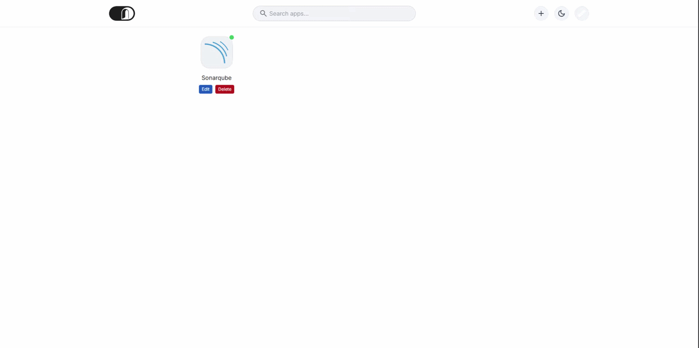

<p align="center">
  
</p>
  
# PortalOn

Self-hosted application portal with iOS/macOS Launchpad-style grid layout.

<p align="center">
  
  
  
  
  
</p>



## 🎯 About

**PortalOn** is a self-hosted application dashboard with iOS/macOS Launchpad-style grid layout. Organize your favorite apps in a responsive grid with squircle icons, real-time status indicators, and drag-and-drop reordering.

Features include:
- Add, edit, and remove apps via modals
- Search and filter applications
- Status indicators (green/red dots)
- Responsive grid (3 columns mobile, 4 columns desktop)
- Glassmorphism UI elements
- 3400+ curated SVG icons

## ✨ Features

| Feature                 | Description                            |
| ----------------------- | -------------------------------------- |
| 📦 **App Management**    | Add, edit, delete apps via modal forms |
| 🔍 **Search & Filter**   | Search and filter applications         |
| 🟢🔴 **Real-time Status** | Green/red status indicators            |
| 🔄 **Drag & Drop**       | Drag-and-drop reordering               |
| 📱 **Responsive Grid**   | 3 cols mobile, 4 cols desktop          |
| 📊 **SVG Icons**         | 3400+ dashboard-style SVG icons        |

## 🏗️ Stack

| Layer        | Technology                        |
| ------------ | --------------------------------- |
| **Backend**  | Go (net/http)                     |
| **Frontend** | Tailwind CSS + HTMX + Sortable.js |
| **Database** | SQLite (pure Go, no CGO)          |
| **DevOps**   | Docker + Docker Compose           |

## 📁 Project Structure

```
PortalOn/
├── main.go                    # Entry point
├── internal/
│   ├── database/              # SQLite connection + migrations
│   ├── handlers/              # HTTP handlers
│   ├── models/                # Data models
│   └── repository/            # Database queries
├── templates/
│   ├── components/            # UI components (co-located HTML + CSS)
│   │   ├── app_card/
│   │   ├── search_bar/
│   │   ├── top_app_bar/
│   │   ├── modal/
│   │   ├── icon_button/
│   │   ├── form_field/
│   │   ├── status_dot/
│   │   └── empty_state/
│   └── index.html
├── static/
│   ├── css/                 # Global CSS (colors, base, utilities, dark-mode)
│   └── icons/               # 3400+ SVG dashboard icons (Apache 2.0)
├── src/                       # TypeScript source
├── Dockerfile
└── docker-compose.yml
```

## 🔌 API

| Method | Endpoint                | Description          |
| ------ | ----------------------- | -------------------- |
| GET    | `/`                     | Main page            |
| GET    | `/api/apps`             | List all apps (JSON) |
| POST   | `/api/apps`             | Create app           |
| PUT    | `/api/apps/{id}`        | Update app           |
| DELETE | `/api/apps/{id}`        | Delete app           |
| POST   | `/api/apps/reorder`     | Reorder apps         |
| GET    | `/api/apps/{id}/status` | Check app status     |

## ⚡ Quick Start

### Local Development

```bash
# Install Go 1.22+
# https://go.dev/dl/

# Download dependencies
go mod tidy

# Run the server
go run main.go
```

Open http://localhost:8888

### Docker

```bash
# Build and run
docker compose up -d

# View logs
docker compose logs -f

# Stop
docker compose down
```

Access: http://localhost:8888

### Environment Variables

| Variable           | Default            | Description          |
| ------------------ | ------------------ | -------------------- |
| `PORTALON_PORT`    | `8888`             | Server port          |
| `PORTALON_DB_PATH` | `data/portalon.db` | SQLite database path |

## 📋 Requirements

- **Go** 1.22+
- **Docker** (optional, for containerization)

## 📜 Legal

**Disclaimer**: All product names, trademarks, and registered trademarks are the property of their respective owners. Icons are used for identification purposes only and do not imply endorsement.

**License**: The dashboard icons are distributed under the [Apache License 2.0](static/icons/LICENSE). See the LICENSE file for full details.

Copyright (c) 2024 Bjorn Lammers, Meier Lukas, Thomas Camlong and Homarr Labs

---

Made with icons by the [Homarr Labs](https://github.com/homarr-labs) team and contributors